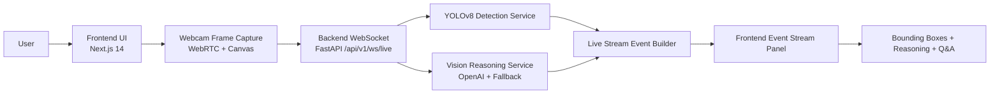

# Visionary AI

**Visionary Agent Protocol**  
Real-time Vision AI infrastructure that watches live video, detects objects, reasons over context, and streams answers instantly.

[](https://github.com/abhay-codes07/visionforge-ai/actions)
[](https://nextjs.org/)
[](https://fastapi.tiangolo.com/)
[](https://www.python.org/)
[](https://www.docker.com/)

---

## Live Demo

- Web app (local): `http://localhost:3000`
- API docs (local): `http://localhost:8000/docs`
- Health check (local): `http://localhost:8000/api/v1/health`
- Demo video: _coming soon_

---

## What is Visionary AI?

Visionary AI is a **real-time multimodal Vision Agent platform**.  
It ingests webcam/video/image inputs, runs live object detection, generates streaming reasoning, and supports live Q&A grounded in the current scene.

It is built for hackathon demo velocity with production-oriented structure: modular services, typed contracts, WebSocket streaming, CI, and Dockerized deployment.

---

## Key Features

- Real-time webcam frame capture and streaming
- YOLOv8 object detection pipeline
- Bounding box overlays with confidence labels
- Token-style streaming reasoning output
- WebSocket live event updates (`session`, `detection`, `reasoning`, `token`, `error`)
- Live Q&A over active video session
- VisionAgents SDK integration path (optional extra)
- Clean monorepo architecture with CI + Docker

---

## Demo Capabilities

- **Security Monitoring**: Detect people/objects and summarize scene risk in real time
- **Workspace Assistant**: Describe desk context and answer live questions about visible items
- **Object Tracking Demo**: Continuous detection updates with confidence overlays
- **Live Intelligence Feed**: Event stream panel for detections, reasoning, and token flow

---

## Screenshots / GIF Placeholders


<!-- Optional GIF placeholders for submissions -->
<!--  -->
<!--  -->

---

## Architecture

### Project Structure

```text
visionforge-ai/
+- frontend/
¦  +- app/
¦  +- components/
¦  +- lib/
¦  +- tests/
+- backend/
¦  +- app/
¦  ¦  +- api/
¦  ¦  +- core/
¦  ¦  +- integrations/
¦  ¦  +- schemas/
¦  ¦  +- services/
¦  +- tests/
+- docker/
+- docs/
+- .github/workflows/
```

### System Flow



---

## Real-Time Streaming Pipeline

1. Frontend captures webcam frames at controlled FPS.
2. Frames are sent via WebSocket as base64 payloads.
3. Backend decodes frame and runs YOLO detection.
4. Vision agent service generates contextual reasoning.
5. Stream service emits structured live events.
6. Frontend renders:
   - detection cards
   - reasoning text
   - token stream
   - bounding box overlays
7. User asks a live question; backend answers from latest scene state.

---

## Tech Stack

### Frontend

| Layer | Technology |
|---|---|
| Framework | Next.js 14 (App Router) |
| Language | TypeScript |
| UI | TailwindCSS |
| Motion | Framer Motion |
| Testing | Vitest + Testing Library |

### Backend

| Layer | Technology |
|---|---|
| API | FastAPI |
| Realtime | WebSockets |
| Vision Detection | YOLOv8 (Ultralytics) |
| AI Reasoning | OpenAI SDK |
| Optional Agent SDK | VisionAgents (`vision-agents` extra) |
| Testing | Pytest |

### Infrastructure

| Layer | Technology |
|---|---|
| Containers | Docker + Docker Compose |
| CI | GitHub Actions |
| Repo Model | Monorepo |

---

## Performance Metrics (Current Pipeline)

> Metrics vary by hardware/model/runtime mode. Current implementation includes these performance controls:

- Frame throttle configuration (`live_frame_max_fps`, default: `8`)
- Bounded async queue for live frame processing (`live_frame_queue_size`, default: `4`)
- Tokenized streaming responses for low-latency UI feedback
- Async WebSocket + service pipeline to prevent UI blocking

---

## Installation

### 1) Clone

```bash
git clone https://github.com/abhay-codes07/visionforge-ai.git
cd visionforge-ai
```

### 2) Environment Files

```bash
# Windows PowerShell
copy backend\.env.example backend\.env
copy frontend\.env.example frontend\.env.local
```

### 3) Install Dependencies

```bash
npm install
```

### 4) Run with Docker (recommended)

```bash
npm run up
npm run logs
```

---

## Development

### Frontend

```bash
npm run dev:frontend
```

### Backend

```bash
npm run dev:backend
```

Equivalent direct command:

```bash
uvicorn app.main:app --reload --host 0.0.0.0 --port 8000 --app-dir backend
```

### Tests

```bash
npm run lint:frontend
npm run test:frontend
npm run test:backend
```

---

## API + Realtime Endpoints

| Type | Endpoint |
|---|---|
| Health | `GET /api/v1/health` |
| Vision Analyze | `POST /api/v1/vision/analyze` |
| Vision Analyze Stream | `POST /api/v1/vision/analyze/stream` |
| Vision Q&A | `POST /api/v1/vision/question` |
| Vision Q&A Stream | `POST /api/v1/vision/question/stream` |
| Live Session Snapshot | `GET /api/v1/live/session/{session_id}` |
| Live Question | `POST /api/v1/live/question` |
| Live WebSocket | `WS /api/v1/ws/live` |

---

## VisionAgents Integration Notes

VisionAgents support is wired as an **optional extra dependency** to avoid FastAPI version conflicts in baseline CI.

Install when needed:

```bash
cd backend
pip install .[visionagents]
```

Enable via environment:

```env
VISIONAGENTS_ENABLED=true
```

---

## Roadmap

- Multi-agent collaboration for specialized scene roles
- GPU acceleration profile for higher FPS inference
- Edge deployment profile for low-bandwidth environments
- Automated anomaly detection and alerting
- Persisted session timelines and replay

---

## Contributing

Contributions are welcome. Keep changes modular, typed, and test-backed.

1. Fork the repository
2. Create a feature branch
3. Run lint/tests locally
4. Open a focused pull request with clear scope

---

## License

MIT

> Add a root `LICENSE` file with MIT text if you plan to distribute publicly.

---

## Maintainer

**Abhay Codes07**  
Repository: `abhay-codes07/visionary-ai`
